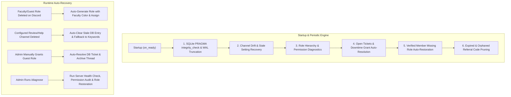

# 🎓 TARVeri — Bot Architecture, Runbook & Self-Healing Guide

TARVeri is a production-grade Discord student & guest verification bot built for TARUMT (Tunku Abdul Rahman University of Management and Technology). It assigns faculty roles to students based on their student IDs and orchestrates a two-step review workflow for non-TARUMT guests.

---

## 🏗️ Architecture & Module Layout

```
Student-verifier/
├── tarveri/
│   ├── __init__.py               # Top-level exports and versioning
│   ├── __main__.py               # python -m tarveri entrypoint
│   ├── bot.py                    # TARVeriBot lifecycle, persistent views, startup self-healing
│   ├── config.py                 # Settings, faculty mappings, colors, HMAC hashing, validation
│   ├── database.py               # Async SQLite layer (WAL mode, PRAGMAs, migrations, backup rotation)
│   ├── rate_limiter.py           # Monotonic sliding-window rate limiting
│   ├── utils.py                  # Ticket formatting (#A0001), TTL schedulers, timestamp parsers
│   ├── services/
│   │   ├── verification_service.py # Student verification logic, role auto-creation, reconciliation
│   │   ├── guest_service.py        # Referral codes, double verification, batch staff tagging, escalation
│   │   └── update_checker.py       # Background git upstream check and DM notifications
│   └── cogs/
│       ├── verification_cog.py   # Student slash (/verify) and text commands, welcome/help auto-tips
│       ├── guest_cog.py          # Guest gateway panel, private review thread views, vouchers
│       └── admin_cog.py          # Admin tools (/stats, /diagnose, /audit, /unverify, /backup)
├── scripts/
│   ├── update.sh                 # Safe upstream git updater with backup and test preflight
│   └── show_servers.py           # CLI database inspector for server settings and metrics
└── tests/                        # 95+ unit tests covering all modules with 0 warnings
```

---

## 🛡️ Self-Healing & Auto-Recovery Engine



### 1. Database Integrity & WAL Checkpoint
- Runs `PRAGMA integrity_check` upon connection startup.
- Executes `PRAGMA wal_checkpoint(TRUNCATE)` on startup and shutdown to keep disk space minimal and SQLite WAL clean.
- Uses `Database.clear_stale_channel_setting(guild_id, channel_type)` to wipe invalid Discord channel IDs from `guild_settings`.

### 2. Channel Self-Healing
- When `find_parent_review_channel`, `get_welcome_or_verify_channel`, or `is_help_channel` encounters a configured channel ID that no longer exists on Discord, it:
  1. Clears the stale setting from SQLite.
  2. Scans for candidate channels matching keywords (`review`, `approval`, `ticket`, `help`, `welcome`).
  3. Verifies bot permissions (`view_channel`, `create_private_threads`, `send_messages`).

### 3. Dynamic Faculty Role Re-Creation
- If an admin deletes a faculty or guest role, the service detects `role is None` and automatically recreates it with standard server design colors:
  - **FAFB**: `#992D22` (Dark Red)
  - **CPUS**: `#1F8673` (Dark Teal)
  - **FOCS**: `#F1C40F` (Yellow / Gold)
  - **FCCI**: `#71368A` (Dark Purple)
  - **FOAS**: `#E74C3C` (Red / Coral Red)
  - **FOBE**: `#2ECC71` (Green / Emerald)
  - **FSSH**: `#3498DB` (Blue)
  - **FOET**: `#BAE973` (Lime Green)
  - **Guest (Approved)**: `#2ECC71` (Green / Emerald)

### 4. Downtime Manual Grant Detection
- If an admin manually grants the `Guest(Approved)` role to an applicant during maintenance or while a ticket is open, `reconcile_downtime_state()` detects `guest_role in applicant.roles`:
  - Closes the ticket as `APPROVED` (*"Applicant was manually granted guest role by admin"*).
  - Updates referral code to `USED`.
  - Sends a notice in the review thread and archives/locks it.

### 5. Returning Verified Member Role Auto-Restoration
- `VerificationService.reconcile_verified_members(guild)` checks all verified students in the database against present guild members.
- If a verified student rejoined during maintenance or had their role stripped, the bot automatically re-assigns their faculty role.

### 6. Role Hierarchy & Permission Diagnostics (`/diagnose`)
- Compares `guild.me.top_role.position` against managed roles (`Guest(Approved)`, `TARUMT Verified`, faculty roles).
- Logs alerts if the bot lacks `Manage Roles` or if a managed role is higher than the bot's top role.
- Administrators can trigger this anytime via `/diagnose`.

---

## 🎟️ Alphanumeric Ticket Sequencing & Smart Escalation

1. **Alphanumeric Ticket Codes**:
   - Ticket sequence numbers are formatted using `format_ticket_seq()`:
     - `1` $\to$ `#A0001`
     - `9999` $\to$ `#A9999`
     - `10000` $\to$ `#B0001`
     - `260000` $\to$ `#AA0001`
2. **Batch-of-2 Staff Tagging**:
   - Selects a batch of exactly 2 admins per notification, prioritizing active/online staff first, then highest-authority staff (Server Owner $\to$ Senior Admins).
3. **1-Hour Ticket Escalation**:
   - Background task `_escalation_loop` checks open review tickets. If 1 hour passes without admin response, it tags the next 2 admins in the hierarchy.

---

## 📋 Slash Commands Reference

### Student Commands
- `/verify [student_id]` — Submit student ID via private modal or direct argument.
- `/referral generate [ttl_hours]` — Generate single-use guest referral code (max 3 active).
- `/referral list` — View active and past referral codes.

### Admin Commands
- `/send_gateway_panel [channel]` — Post 3-button verification gateway panel.
- `/diagnose` — Run self-healing diagnostics, check role hierarchy, and restore missing member roles.
- `/setadminrole [role]` — Set server's reviewer/admin role.
- `/setguestrole [role_name]` — Set custom guest role name (default: `Guest`).
- `/setreviewchannel [channel]` — Set parent channel for guest review threads.
- `/setwelcomec [channel]` — Set welcome channel for new joiner verification tags.
- `/sethelpc [channel]` — Set help channel for automated role tips.
- `/guest_tickets [status] [limit]` — Query guest tickets with links to threads.
- `/stats` — View verification numbers and faculty breakdown.
- `/unverify @user` — Unlink student ID and strip faculty roles.
- `/audit [limit] [event_type]` — Inspect database audit logs.
- `/backup` — Create immediate database snapshot (10-file auto-rotation).
- `/resync` — Re-synchronize roles across mutual servers.
- `/check_updates [stream]` — Check git upstream for new commits.

---

## 🧪 Testing & Quality Guidelines

- Run the full test suite with all warnings treated as errors:
  ```bash
  .venv/bin/pytest -v -W error
  ```
- All mock guild objects in tests must initialize `guild.roles = []` and `member.roles = []` to prevent `_aget` unawaited coroutine warnings.

---

## 🏷️ Release & Tagging Policy

- **Feature Releases Only**: Only create and push annotated Git tags for **major/minor feature releases** (e.g. `v1.0.0`, `v2.0.0`, `v2.4.0`).
- **No Patch Tags**: Do **NOT** create Git tags for tiny bugfixes, cosmetic adjustments, or small patch updates (e.g. do not tag `v2.4.1`). Bugfixes and maintenance updates should remain as clean, descriptive commits on `main` without creating new Git tags.
- **Pre-Merge Tagging**: When merging a major pull request that transforms an existing architecture, tag the baseline on `main` *before* the merge (e.g. `v1.0.0`), then tag the new feature version (e.g. `v2.4.0`) on `main` after the merge.

