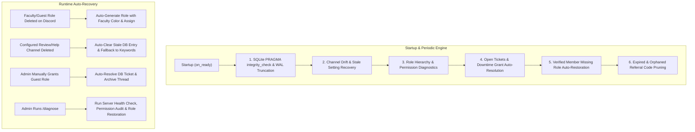
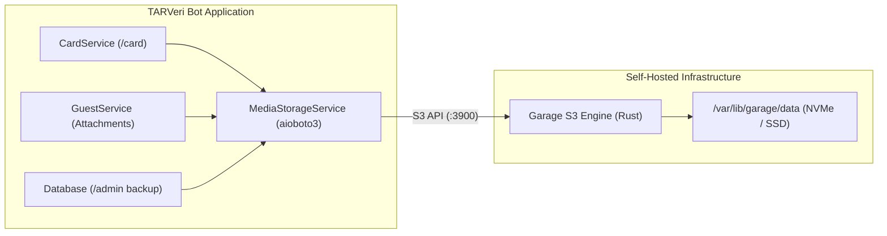
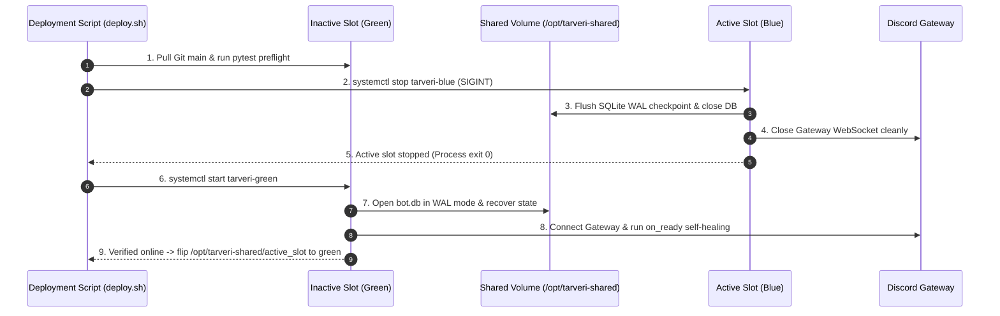

# 🎓 TARVeri — Bot Architecture, Runbook & Self-Healing Guide

TARVeri is a production-grade Discord student & guest verification bot built for TARUMT (Tunku Abdul Rahman University of Management and Technology). It assigns faculty roles to students based on their student IDs and orchestrates a two-step review workflow for non-TARUMT guests.

---

## 🏗️ Architecture & Module Layout

```
Student-verifier/
├── tarveri/
│   ├── __init__.py               # Top-level exports and versioning
│   ├── __main__.py               # python -m tarveri entrypoint
│   ├── bot.py                    # TARVeriBot lifecycle, persistent views, startup self-healing
│   ├── config.py                 # Settings, faculty mappings, colors, HMAC hashing, validation
│   ├── database.py               # Async SQLite layer (WAL mode, PRAGMAs, migrations, backup rotation)
│   ├── rate_limiter.py           # Monotonic sliding-window rate limiting
│   ├── utils.py                  # Ticket formatting (#A0001), TTL schedulers, timestamp parsers
│   ├── services/
│   │   ├── verification_service.py # Student verification logic, role auto-creation, reconciliation
│   │   ├── guest_service.py        # Referral codes, double verification, batch staff tagging, escalation
│   │   ├── log_service.py          # Daily log rotation, 10-day period grouping & .tar.gz compression
│   │   ├── outage_service.py       # Network probe watchdog, debounce & power outage signals
│   │   └── update_checker.py       # Background git upstream check and DM notifications
│   └── cogs/
│       ├── verification_cog.py   # Student slash (/verify) and text commands, welcome/help auto-tips
│       ├── guest_cog.py          # Guest gateway panel, private review thread views, vouchers
│       └── admin_cog.py          # Admin tools (/stats, /diagnose, /audit, /unverify, /backup, /logs)
├── scripts/
│   ├── update.sh                 # Safe upstream git updater with backup and test preflight
│   └── show_servers.py           # CLI database inspector for server settings and metrics
└── tests/                        # 130 unit tests covering all modules with 0 warnings
```

---

## 🛡️ Self-Healing & Auto-Recovery Engine



### 1. Database Integrity & WAL Checkpoint
- Runs `PRAGMA integrity_check` upon connection startup.
- Executes `PRAGMA wal_checkpoint(TRUNCATE)` on startup and shutdown to keep disk space minimal and SQLite WAL clean.
- Uses `Database.clear_stale_channel_setting(guild_id, channel_type)` to wipe invalid Discord channel IDs from `guild_settings`.

### 2. Channel Self-Healing
- When `find_parent_review_channel`, `get_welcome_or_verify_channel`, or `is_help_channel` encounters a configured channel ID that no longer exists on Discord, it:
  1. Clears the stale setting from SQLite.
  2. Scans for candidate channels matching keywords (`review`, `approval`, `ticket`, `help`, `welcome`).
  3. Verifies bot permissions (`view_channel`, `create_private_threads`, `send_messages`).

### 3. Dynamic Faculty Role Re-Creation
- If an admin deletes a faculty or guest role, the service detects `role is None` and automatically recreates it with standard server design colors:
  - **FAFB**: `#992D22` (Dark Red)
  - **CPUS**: `#1F8673` (Dark Teal)
  - **FOCS**: `#F1C40F` (Yellow / Gold)
  - **FCCI**: `#71368A` (Dark Purple)
  - **FOAS**: `#E74C3C` (Red / Coral Red)
  - **FOBE**: `#2ECC71` (Green / Emerald)
  - **FSSH**: `#3498DB` (Blue)
  - **FOET**: `#BAE973` (Lime Green)
  - **Guest (Approved)**: `#2ECC71` (Green / Emerald)

### 4. Downtime Manual Grant Detection
- If an admin manually grants the `Guest(Approved)` role to an applicant during maintenance or while a ticket is open, `reconcile_downtime_state()` detects `guest_role in applicant.roles`:
  - Closes the ticket as `APPROVED` (*"Applicant was manually granted guest role by admin"*).
  - Updates referral code to `USED`.
  - Sends a notice in the review thread and archives/locks it.

### 5. Returning Verified Member & Alumni Role Auto-Restoration
- `VerificationService.reconcile_verified_members(guild)` checks all verified students in the database against present guild members and restores missing faculty roles.
- `VerificationService.reconcile_alumni_members(guild)` checks all claimed alumni in the database and restores the `TARUMT Alumni` role across mutual servers during bot startup and `/diagnose`.

### 6. Duplicate Role Reconciliation & Cleanup Engine
- `VerificationService.reconcile_duplicate_roles(guild)` automatically scans guilds for duplicate faculty or guest roles (e.g. `FOCS` vs `focs` or newly spawned bottom duplicates).
- Identifies the primary role (highest position in role hierarchy and member count).
- Migrates all members on redundant duplicate role(s) to the primary role (`add_roles` + `remove_roles`).
- **Strict Bot-Created Protection**: ONLY deletes redundant duplicate role(s) that were created by the bot (tracked via SQLite `bot_created_roles` and Discord audit logs). Admin-created roles are strictly preserved.
- Automatically invoked during bot startup self-healing and via the `/diagnose` slash command.

### 7. Role Hierarchy & Permission Diagnostics (`/diagnose`)
- Compares `guild.me.top_role.position` against managed roles (`Guest(Approved)`, `TARUMT Verified`, `TARUMT Alumni`, faculty roles).
- Detects duplicate roles and logs alerts if the bot lacks `Manage Roles` or if a managed role is higher than the bot's top role.
- Administrators can trigger this anytime via `/diagnose`.

### 8. SRC & Council Role Protection & Auto-Restoration
- Protects organizational, council, and functional roles (`ROLE_QUALIFIER_PATTERN`: `SRC`, `Council`, `Exco`, `Committee`, `Staff`, `Rep`, etc.) from being matched as generic faculty roles or cleaned up during deduplication.
- `VerificationService.restore_src_roles(guild)` checks for all 8 faculty SRC roles (`FAFB SRC`, `CPUS SRC`, `FOCS SRC`, `FCCI SRC`, `FOAS SRC`, `FOBE SRC`, `FSSH SRC`, `FOET SRC`).
- Recreates missing SRC roles using their corresponding official faculty palette colors and mentionable flag on bot startup and during `/diagnose`.

### 9. Alumni & Graduation Transition System
- Verified students self-claim alumni status via `/graduate [year] [programme]` (or an interactive modal popup).
- Auto-creates/assigns the `TARUMT Alumni` role (`#D4AF37` Academic Gold) across mutual guilds.
- Updates the Digital Campus Card (`/card` and user context menu) to display `GRADUATED ALUMNI` status pill, `❖ ALUMNI` achievement badge, and `Class of [Year] • [Faculty] Alumni` cohort subtitle.
- Admins can revoke alumni status via `/alumni_revoke @user [reason]`.

### 10. Network & Power Outage Watchdog (`OutageService`)
- Continuously monitors Discord gateway status, socket reachability (raw DNS IPs `1.1.1.1:53`, `8.8.8.8:53`, and `discord.com:443`), and OS signals (`SIGPWR`, `SIGTERM`, `SIGINT`, `SIGHUP`).
- **5-Minute Grace Period**: When a network outage or gateway disconnect is detected, starts a 5-minute (300-second) watchdog countdown.
- **Auto-Recovery**: If internet or gateway connectivity restores within 5 minutes, automatically cancels the countdown and resumes normal operations.
- **Emergency Graceful Shutdown**: If the outage persists continuously for 5 minutes, or if an OS power failure signal (`SIGPWR`) is received from UPS / systemd, initiates an emergency graceful shutdown, cleanly checkpointing SQLite WAL to protect against database corruption.

### 11. Daily Log Rotation & 10-Day Period Tar.Gz Archiving (`LogRotationService`)
- **Daily Log Partitioning**: All application logs are stored in `logs/` and partitioned by calendar day (`logs/tarveri-YYYY-MM-DD.log`) using the configured timezone (`Asia/Kuala_Lumpur`).
- **10-Day Decade Grouping**: Daily logs older than 10 days are automatically discovered and grouped into 10-day decade bins by year and month:
  - Part 1: Days 01–10 (`tarveri-logs-YYYY-MM-01_to_YYYY-MM-10.tar.gz`)
  - Part 2: Days 11–20 (`tarveri-logs-YYYY-MM-11_to_YYYY-MM-20.tar.gz`)
  - Part 3: Days 21–End (`tarveri-logs-YYYY-MM-21_to_YYYY-MM-(28..31).tar.gz`)
- **Automated Tarball Compression & Cleanup**: Bundles old logs into gzip-compressed `.tar.gz` archives in `logs/archives/`, seamlessly merging with existing archives if needed, and safely deletes uncompressed log files to conserve disk space.
- **On-Demand Admin Management**: Inspect daily logs, archives, and manually trigger compression anytime using `/logs`.

### 12. Branch Campus & Study Level Roles & Backfill Engine
- **ID Structure Decomposition**: Parses TARUMT student IDs (`YY[B][F][L]XXXXX` e.g. `24WMD12345` or `23PMR12345`):
  - **Branch Campuses**: `W` (KL Main Campus), `P` (Penang Branch), `A` (Perak Branch), `J` (Johor Branch), `C`/`K` (Pahang Branch), `S` (Sabah Branch).
  - **Study Levels**: `D` (Diploma), `R` (Bachelor's Degree), `F` (Foundation), `P` (Postgraduate / Master / PhD).
- **Atomic Multi-Role Provisioning**: When verified, students concurrently receive:
  1. Base verification role (`TARUMT Verified` / `#16A085`)
  2. Faculty role (e.g. `FOCS` / `#F1C40F`)
  3. Campus role (e.g. `TARUMT KL Main Campus` / `#2980B9`, `TARUMT Penang Campus` / `#16A085`, etc.)
  4. Study level role (e.g. `Bachelor's Degree` / `#8E44AD`, `Diploma` / `#3498DB`, `Foundation` / `#E67E22`, `Postgraduate` / `#9B59B6`)
- **Backward Compatible Auto-Migration**: Automatically adds `campus_code` and `level_code` columns to SQLite `verifications` table.
- **Legacy Backfill Engine**: Automatically maps legacy records without campus/level tags (defaults `W` and `R`), reconciles with existing Discord guild roles during `reconcile_verified_members()`, and provides administrative migration via `/admin backfill_roles`.

---

## 🎟️ Alphanumeric Ticket Sequencing & Smart Escalation

1. **Alphanumeric Ticket Codes**:
   - Ticket sequence numbers are formatted using `format_ticket_seq()`:
     - `1` $\to$ `#A0001`
     - `9999` $\to$ `#A9999`
     - `10000` $\to$ `#B0001`
     - `260000` $\to$ `#AA0001`
2. **Batch-of-2 Staff Tagging**:
   - Selects a batch of exactly 2 admins per notification, prioritizing active/online staff first, then highest-authority staff (Server Owner $\to$ Senior Admins).
3. **1-Hour Ticket Escalation**:
   - Background task `_escalation_loop` checks open review tickets. If 1 hour passes without admin response, it tags the next 2 admins in the hierarchy.

---

## 📋 Slash Commands Reference

### Student & Member Commands
- `/verify [student_id]` — Submit student ID via private modal or direct argument.
- `/graduate [year] [programme]` — Instant graduation claim for verified students to receive `TARUMT Alumni` role and card badge.
- `/card [member] [hidden]` — Generate and render high-DPI digital student/guest/alumni ID card with glassmorphism design and achievement badges (public by default, or `hidden: True`).
- `View Campus Card` (User Context Menu) — Inspect and share member's campus card via Discord user menu.
- `/referral generate [ttl_hours]` — Generate single-use guest referral code (max 3 active).
- `/referral list` — View active and past referral codes.

### 🛡️ Administrator Control Center (`/admin`)
- `/admin dashboard` — Launches the rich interactive **TARVeri Administrator Control Center** UI with live category navigation, quick diagnostics, channel/role pickers, unverify/revoke modals, and backup triggers.
- `/admin stats` — View student verification numbers, alumni metrics, and faculty distribution.
- `/admin diagnose` — Run self-healing diagnostics, check role hierarchy, restore SRC roles, and reconcile missing member/alumni roles.
- `/admin backfill_roles [default_campus] [default_level] [all_servers]` — Batch sync and assign missing branch campus and study level roles to all verified members.
- `/admin unverify @user [reason]` — Unlink student ID and strip faculty roles across mutual servers.
- `/admin alumni_revoke @user [reason]` — Revoke Alumni status and strip `TARUMT Alumni` role across mutual servers.
- `/admin set_channel [type] [channel]` — Configure or reset welcome, help, or guest review channels in one command.
- `/admin set_role [type] [role/name]` — Configure or reset custom guest role name or reviewer/admin role.
- `/admin panel [channel]` — Deploy the persistent 3-button verification gateway panel.
- `/admin tickets [status] [limit]` — Query guest review tickets with links to threads and resolution notes.
- `/admin backup [action] [backup_file]` — Create backups, list snapshots, or restore previous latest server settings.
- `/admin logs [action]` — Inspect active daily logs in `logs/`, list 10-day compressed archives, or trigger immediate `.tar.gz` rotation.
- `/admin audit [limit] [event_type]` — Inspect database audit logs with event type filtering.
- `/admin resync` — Re-synchronize roles across mutual servers.
- `/admin updates [stream]` — Check git upstream for new commits.
- `/admin sync_commands` — Force sync application commands with Discord and clear duplicates.

---

## 🔮 Future Architecture & Infrastructure Plans

### 1. Garage Rust-Based S3 Object Storage (Media Pipeline)



#### Why Garage Object Storage?
- **Ultra-Lightweight Rust Engine**: Consumes <20MB RAM vs Java/Go behemoths (MinIO), running seamlessly on modest VPS or homelab servers alongside the bot.
- **Zero Database Bloat**: Offloads binary payloads (passport card PNGs, guest proof screenshots, identity documents, database snapshots) from SQLite/PostgreSQL, keeping relational tables lean and indexing blazing fast.
- **S3-Compatible API**: Standard AWS S3 SDK compatibility (`aioboto3`, `boto3`, `botocore`) with bucket policies and presigned URL capabilities.
- **Resilient Replication**: Native single-node or multi-node geo-distributed CRDT topology without external metadata dependencies.

#### Target Bucket Hierarchy (`tarveri-media`)
```
tarveri-media/
├── cards/
│   └── {student_id_hash}_{theme_version}.png    # Cached rendered digital ID cards
├── proofs/
│   └── {ticket_seq}/{timestamp}_{random_id}.png # Guest proof screenshots & docs
├── avatars/
│   └── {discord_user_id}.png                   # Cached member avatars for cards
└── backups/
    └── db_{timestamp}.sqlite.gz                 # Compressed database snapshots
```

#### Garage Configuration (`garage.toml`)
```toml
metadata_dir = "/var/lib/garage/meta"
data_dir = "/var/lib/garage/data"
db_engine = "sqlite"

[rpc]
bind_addr = "127.0.0.1:3901"
rpc_secret = "0123456789abcdef0123456789abcdef0123456789abcdef0123456789abcdef"

[s3_api]
s3_region = "garage"
api_bind_addr = "127.0.0.1:3900"
root_domain = ".s3.garage"
```

#### Provisioning & Bucket Initialization
```bash
# 1. Assign single-node layout
garage layout assign -z dc1 -c 20G $(garage node id)
garage layout apply --version 1

# 2. Create media bucket and bot credentials
garage bucket create tarveri-media
garage key create tarveri-bot-key
garage bucket allow --read --write --owner tarveri-media --key tarveri-bot-key
```

#### Python `MediaStorageService` Integration Pattern
```python
import aioboto3
from tarveri.config import settings

class MediaStorageService:
    def __init__(self):
        self.session = aioboto3.Session()
        self.endpoint_url = settings.s3_endpoint_url  # e.g. "http://127.0.0.1:3900"
        self.bucket = settings.s3_bucket_name         # "tarveri-media"

    async def put_media(self, key: str, data: bytes, content_type: str = "image/png") -> str:
        async with self.session.client(
            "s3",
            endpoint_url=self.endpoint_url,
            aws_access_key_id=settings.s3_access_key,
            aws_secret_access_key=settings.s3_secret_key,
        ) as s3:
            await s3.put_object(
                Bucket=self.bucket,
                Key=key,
                Body=data,
                ContentType=content_type,
            )
            return f"{self.endpoint_url}/{self.bucket}/{key}"

    async def generate_presigned_url(self, key: str, ttl_seconds: int = 3600) -> str:
        async with self.session.client(
            "s3",
            endpoint_url=self.endpoint_url,
            aws_access_key_id=settings.s3_access_key,
            aws_secret_access_key=settings.s3_secret_key,
        ) as s3:
            return await s3.generate_presigned_url(
                "get_object",
                Params={"Bucket": self.bucket, "Key": key},
                ExpiresIn=ttl_seconds,
            )
```

---

### 2. Blue-Green Production Deployment for Discord Bots



#### The Discord Gateway Constraint
- Unlike stateless HTTP APIs where load balancers (Nginx/Envoy) can route traffic between blue and green instances concurrently, a Discord bot maintains a **stateful, singleton Gateway WebSocket connection**.
- Running two instances with the same bot token simultaneously triggers:
  1. Gateway session invalidation and collision errors (`400 Bad Request`).
  2. Duplicate event dispatching (e.g. users receiving duplicate responses and roles).
  3. Discord API interaction timeout conflicts.
- **Solution**: Coordinated rapid switchover where the active slot performs an immediate clean `SIGINT` shutdown (checkpointing WAL in <500ms), followed immediately by the inactive slot starting up and resuming the gateway session. Total downtime is under 2–3 seconds.

#### Dual-Slot Directory Layout
```
/opt/
├── tarveri-blue/                 # Blue slot application checkout
│   ├── .venv/
│   └── tarveri/
├── tarveri-green/                # Green slot application checkout
│   ├── .venv/
│   └── tarveri/
└── tarveri-shared/               # Persistent shared state
    ├── active_slot               # File containing "blue" or "green"
    ├── .env                      # Production secrets & bot token
    ├── data/
    │   └── bot.db                # Shared SQLite database (WAL mode)
    └── logs/                     # Shared rotating log files
```

#### Systemd Unit Definitions
`/etc/systemd/system/tarveri-blue.service` (and green counterpart):
```ini
[Unit]
Description=TARVeri Discord Bot (Blue Slot)
After=network-online.target
Wants=network-online.target

[Service]
Type=simple
User=tarveri
Group=tarveri
WorkingDirectory=/opt/tarveri-blue
EnvironmentFile=/opt/tarveri-shared/.env
Environment=DATA_DIR=/opt/tarveri-shared/data
Environment=LOG_DIR=/opt/tarveri-shared/logs
ExecStart=/opt/tarveri-blue/.venv/bin/python -m tarveri
KillSignal=SIGINT
TimeoutStopSec=15
Restart=no

[Install]
WantedBy=multi-user.target
```

#### Zero-Downtime Switchover Script (`scripts/deploy_blue_green.sh`)
```bash
#!/usr/bin/env bash
set -euo pipefail

SHARED_DIR="/opt/tarveri-shared"
ACTIVE_SLOT=$(cat "$SHARED_DIR/active_slot" 2>/dev/null || echo "blue")

if [ "$ACTIVE_SLOT" = "blue" ]; then
    TARGET_SLOT="green"
    ACTIVE_SERVICE="tarveri-blue"
    TARGET_SERVICE="tarveri-green"
else
    TARGET_SLOT="blue"
    ACTIVE_SERVICE="tarveri-green"
    TARGET_SERVICE="tarveri-blue"
fi

TARGET_DIR="/opt/tarveri-$TARGET_SLOT"
echo "🚀 Starting Blue-Green deployment to [$TARGET_SLOT]..."

# 1. Update target codebase
cd "$TARGET_DIR"
git fetch origin main
git reset --hard origin/main
"$TARGET_DIR/.venv/bin/pip" install -r requirements.txt --quiet

# 2. Run test preflight on target slot
"$TARGET_DIR/.venv/bin/pytest" -v -W error

# 3. Gracefully stop active slot (triggers WAL checkpoint & clean gateway disconnect)
echo "⏸️ Stopping active slot [$ACTIVE_SLOT]..."
sudo systemctl stop "$ACTIVE_SERVICE"

# 4. Start target slot
echo "▶️ Starting target slot [$TARGET_SLOT]..."
sudo systemctl start "$TARGET_SERVICE"

# 5. Verify target slot health (wait up to 10s for active state)
sleep 3
if sudo systemctl is-active --quiet "$TARGET_SERVICE"; then
    echo "$TARGET_SLOT" > "$SHARED_DIR/active_slot"
    echo "✅ Successfully switched active slot to [$TARGET_SLOT]!"
else
    echo "❌ Target slot failed to start! Rolling back to [$ACTIVE_SLOT]..."
    sudo systemctl start "$ACTIVE_SERVICE"
    exit 1
fi
```

---

## 🎓 Academic Level Progression & Lifecycle Watchdog Engine

### 1. Multi-Level Transition Pipeline
- Students progressing between academic levels (e.g. CPUS/Foundation $\to$ Degree, Diploma $\to$ Degree, Degree $\to$ Postgraduate) simply run `/verify student_id:<new_id>` (with optional `expiry_date:<MM/YY>`).
- **Archive & Audit**: The transition pipeline records previous study level, faculty, campus, and hashed ID in `verification_transitions` without exposing sensitive student ID details publicly.
- **Atomic Role Sync**: Strips previous faculty, campus, study level, and alumni roles, and assigns new roles across all mutual guilds.

### 2. Student Card Expiry & Lifecycle Resolution
- Card validity dates (parsed from `MM/YY`, `YYYY-MM-DD`, `OCT 2026`, etc.) are tracked in `verifications.card_expiry_date`.
- `GraduationWatchdogService` runs background periodic sweeps (every 24h) scanning `get_expired_student_verifications()`.
- Expired students are prompted with `StudentLifecycleResolutionView` presenting 3 resolution paths:
  1. 🎓 **"I have Graduated"**: Claims `TARUMT Alumni` role + card badge.
  2. 📚 **"Further Studies at TARUMT"**: Opens `FurtherStudyTransitionModal` for new Student ID & expiry date.
  3. ⏳ **"Still Studying / Extension"**: Opens `ExtendExpiryModal` to update expiry date.
- **Active Chat & `/card` Interception**: When an expired student posts in a channel or views their `/card`, the bot provides the `StudentLifecycleResolutionView` with a 7-day cooldown to prevent spam.

---

## 🧪 Testing & Quality Guidelines

- Run the full test suite with all warnings treated as errors:
  ```bash
  .venv/bin/pytest -v
  ```
- All mock guild objects in tests must initialize `guild.roles = []` and `member.roles = []` to prevent `_aget` unawaited coroutine warnings.

---

## 🏷️ Release & Tagging Policy

- **Feature Releases Only**: Only create and push annotated Git tags for **major/minor feature releases** (e.g. `v1.0.0`, `v2.0.0`, `v2.4.0`).
- **No Patch Tags**: Do **NOT** create Git tags for tiny bugfixes, cosmetic adjustments, or small patch updates (e.g. do not tag `v2.4.1`). Bugfixes and maintenance updates should remain as clean, descriptive commits on `main` without creating new Git tags.
- **Pre-Merge Tagging**: When merging a major pull request that transforms an existing architecture, tag the baseline on `main` *before* the merge (e.g. `v1.0.0`), then tag the new feature version (e.g. `v2.4.0`) on `main` after the merge.

