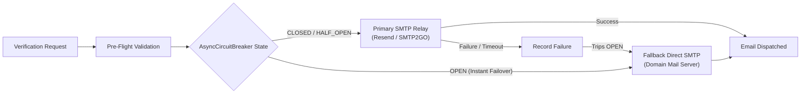

# 🏗️ Architecture, Security & Disaster Recovery

TARVeri is designed with a zero-knowledge security posture, non-blocking asynchronous I/O, automated failover circuit breakers, and continuous cloud backup.

---

## 📋 Table of Contents
1. [Zero-Knowledge Security Architecture](#zero-knowledge-security-architecture)
2. [Dual-Relay Email & Circuit Breaker](#dual-relay-email--circuit-breaker)
3. [SQLite Concurrency & WAL Checkpoint](#sqlite-concurrency--wal-checkpoint)
4. [Litestream Continuous Cloud Replication](#litestream-continuous-cloud-replication)
5. [Real-Time Telemetry with Sentry](#real-time-telemetry-with-sentry)
6. [Outage Watchdog & Self-Healing](#outage-watchdog--self-healing)

---

## 1. Zero-Knowledge Security Architecture

- **HMAC-SHA256 Blind Indexing**: Student IDs and email addresses are hashed with a salted secret (`TARVERI_ID_HASH_SECRET`). Lookups and duplicate prevention are executed purely on hashes without storing or querying raw PII.
- **Fernet AES-256 Symmetric Encryption**: Raw email strings are encrypted with AES-128-CBC + HMAC-SHA256 before disk writes.
- **Timing-Attack Resistance**: OTP validation uses `secrets.compare_digest()` for constant-time comparison.

---

## 2. Dual-Relay Email & Circuit Breaker



- **Non-Blocking `aiosmtplib`**: Delivers emails directly on the `asyncio` event loop without thread pool executor overhead.
- **`AsyncCircuitBreaker`**: If Primary SMTP fails 3 consecutive times, it trips **`OPEN`**, instantly routing subsequent verification requests to Fallback SMTP with **0ms timeout penalty**. Probes recovery in **`HALF_OPEN`** after 300s.

---

## 3. SQLite Concurrency & WAL Checkpoint

- **Write-Ahead Logging (`journal_mode=WAL`)**: Allows concurrent reads without blocking writes.
- **Busy Timeout**: Configured with `busy_timeout=15000` (15 seconds) to prevent database lock exceptions during traffic spikes.
- **Clean Checkpoints**: Truncates WAL on startup and shutdown (`PRAGMA wal_checkpoint(TRUNCATE)`).

---

## 4. Litestream Continuous Cloud Replication

TARVeri supports [Litestream](https://litestream.io) for continuous frame-by-frame SQLite streaming to Cloudflare R2 / AWS S3:

```yaml
dbs:
  - path: tarveri.db
    replicas:
      - type: s3
        bucket: "${LITESTREAM_BUCKET}"
        path: "db"
        endpoint: "${LITESTREAM_ENDPOINT}"
        access-key-id: "${LITESTREAM_ACCESS_KEY_ID}"
        secret-access-key: "${LITESTREAM_SECRET_ACCESS_KEY}"
        sync-interval: 10s
        retention: 720h
```

**Commands:**
- **Replicate**: `litestream replicate -config litestream.yml`
- **Restore**: `litestream restore -config litestream.yml -o tarveri.db`

---

## 5. Real-Time Telemetry with Sentry

Set `TARVERI_SENTRY_DSN` in `.env` to capture unhandled Discord interaction exceptions, database anomalies, and background task errors in real time.

Test your Sentry setup from the CLI:
```bash
python3 scripts/test_sentry.py
```

---

## 6. Outage Watchdog & Self-Healing

- **Network Probe Daemon**: Tests gateway connectivity and debounces alerts (300s window) during ISP instability.
- **Power Signal Checkpoint**: Captures `SIGPWR` (from UPS daemons) to flush SQLite WAL to disk immediately before shutdown.
- **Self-Healing on Startup**: Auto-recreates deleted roles, discovers valid review channels, and syncs member states.
