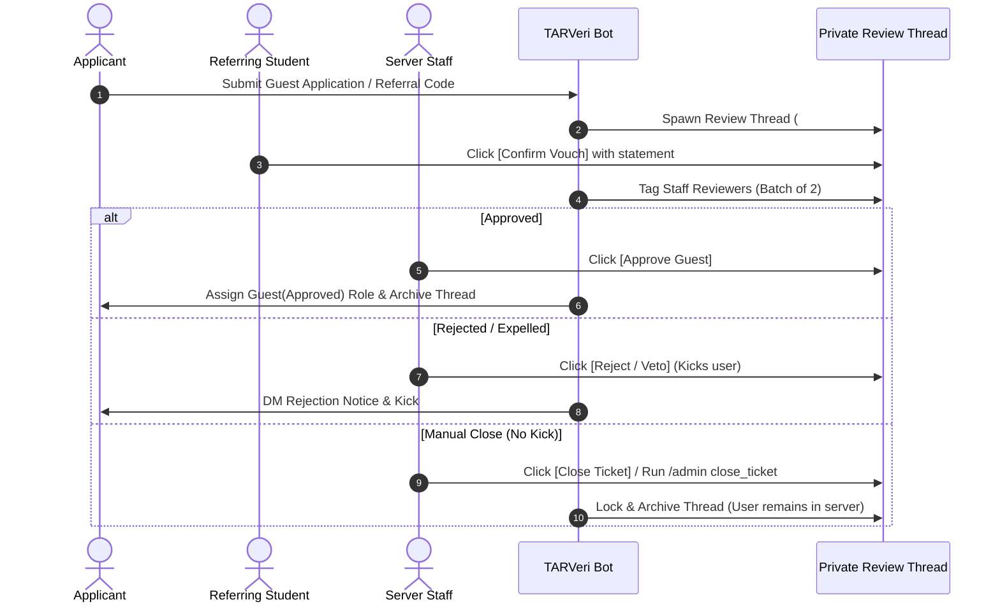

# 🎟️ Guest Onboarding & Review Workflow

TARVeri provides a double-verification workflow for external guests, industry partners, and non-TARUMT members.

---

## 📋 Table of Contents
1. [Guest Entry Options](#guest-entry-options)
2. [Double Verification Review Process](#double-verification-review-process)
3. [Alphanumeric Ticket Tracking](#alphanumeric-ticket-tracking)
4. [Intelligent Staff Tagging & Auto-Escalation](#intelligent-staff-tagging--auto-escalation)
5. [Automatic Revocation](#automatic-revocation)

---

## 1. Guest Entry Options

Guests join via the persistent Gateway Panel (`/admin panel`) in the welcome channel:

- **With Referral Code**: Enter a single-use referral code generated by a verified student (`/referral generate`).
- **Direct Application**: Apply directly by submitting their full name, affiliation, and purpose of joining.

---

## 2. Double Verification Review Process

---

## 3. Alphanumeric Ticket Tracking

Guest review threads and audit records use alphanumeric sequence numbers:
- `#A0001` through `#A9999`
- Rollover to `#B0001` through `#Z9999` $\to$ `#AA0001`

---

## 4. Intelligent Staff Tagging & Auto-Escalation

1. **Active Staff First**: The bot tags 2 online/active moderators first.
2. **1-Hour Auto-Escalation**: If moderators do not respond within 1 hour, TARVeri automatically escalates by tagging the next batch of admins.
3. **User-Accessible Thread Discovery**: Private threads are spawned in public help channels (`#ask-for-help`, `#support`) where unverified users have view permissions, avoiding admin-locked channel deadlocks.

---

## 5. Automatic Revocation

If a verified guest leaves, is kicked, or is banned, active review tickets are automatically closed and referral codes invalidated in SQLite.
